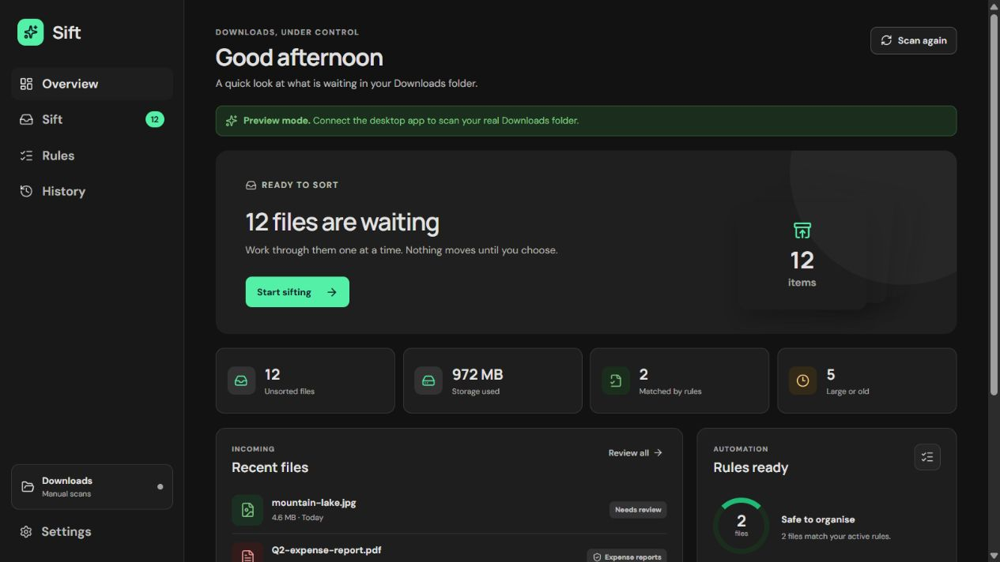
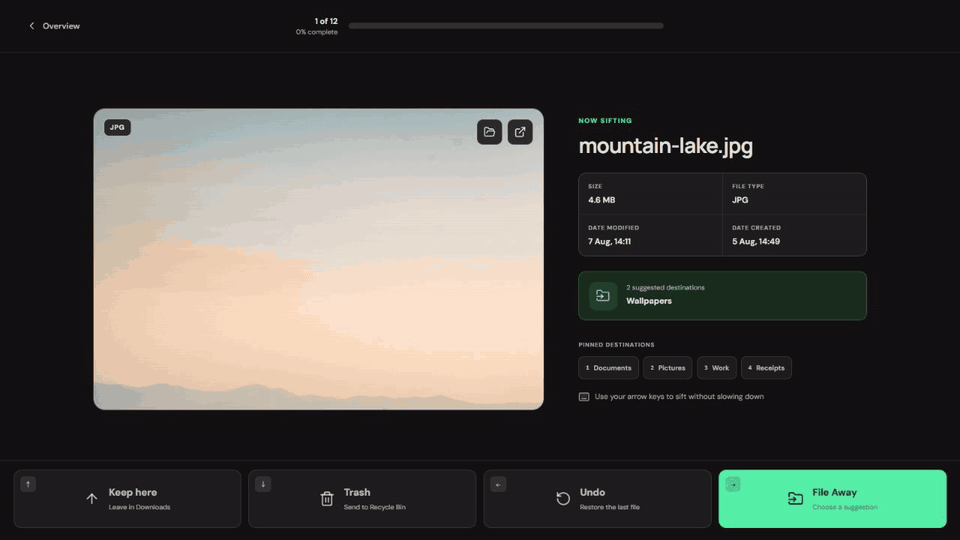
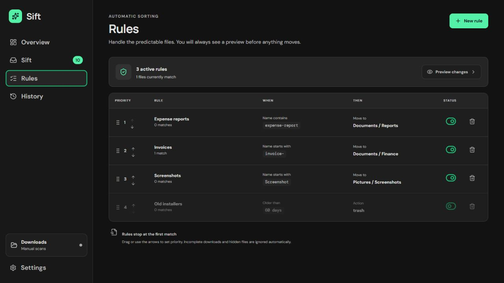

<div align="center">
  
  <h1>Sift</h1>
  <p><strong>A fast, keyboard-first way to bring your Downloads folder back under control.</strong></p>
  <p>
    
    
    
    
  </p>
</div>

Sift is a lightweight, local-first Windows desktop app for reviewing and organising downloaded files. It combines a focused one-file-at-a-time workflow with optional rules for predictable files. Files never leave your computer, and Sift shows every rule result before applying it.



## See it in action

The right arrow opens the best destination or a compact destination chooser. After Keep, Trash, or File Away, Sift advances immediately.



[Watch the MP4 demo](docs/media/sifting-demo.mp4)

## How sifting works

| Key          | Action    | Result                                                                  |
| ------------ | --------- | ----------------------------------------------------------------------- |
| <kbd>↑</kbd> | Keep here | Leaves the file where it is and advances                                |
| <kbd>↓</kbd> | Trash     | Stages the file in Sift Trash for review and advances                   |
| <kbd>←</kbd> | Undo      | Restores the previous file and returns to it                            |
| <kbd>→</kbd> | File Away | Uses a suggestion, shows quick destinations, or opens the folder picker |

Shortcuts can be rebound in Settings. Held keys are ignored, so one long keypress cannot process an entire queue.


Sift keeps the useful details visible while you decide: file name, type, size, modified date, and created date. Images, video, audio, PDFs, text, and Markdown receive suitable previews; every file can also be opened in its default app or revealed in File Explorer.

## Safe by default

Trash normally moves files into an app-managed staging area. When you return to Overview or close Sift, a review sheet lets you restore individual files, restore a selection, or send the selection to the Windows Recycle Bin.

An optional setting skips staging and sends files directly to the Recycle Bin. Those actions can still be restored from History while Windows still has the exact Recycle Bin item and the original path is free.

Other safeguards include:

- first-match-wins rule evaluation with a dry-run preview;
- unique destination names instead of overwriting existing files;
- rollback if a move succeeds but its history entry cannot be recorded;
- incomplete downloads and symbolic links ignored during scans;
- all file operations performed locally by the Rust backend.

## Rules without surprises

Rules can match extensions, file names, glob patterns, regular expressions, file size, or age. A rule can move, trash, or ignore a matching file. Priorities, enabled state, and rules are stored locally and remain available between launches.



## Lightweight by design

Sift uses the Windows WebView2 runtime already available on supported Windows installations rather than shipping a browser engine. The native backend handles scanning and file operations; Svelte renders the interface.

Measured from the optimized `0.1.0` x64 release build:

| Artifact                   |      Size |
| -------------------------- | --------: |
| Installed `sift.exe`       |  3.93 MiB |
| NSIS installer             |  1.61 MiB |
| Frontend JavaScript (gzip) | 54.82 KiB |
| Frontend CSS (gzip)        | 10.61 KiB |

The release profile uses link-time optimization, one codegen unit, size-oriented optimization, panic aborts, symbol stripping, and Tauri's unused-command removal. These changes reduced the app executable from 10.56 MiB to 3.93 MiB without removing product features.

## Privacy

Sift has no account, telemetry, cloud storage, or upload path. Preferences and rules stay in local browser storage; operation history and staged-trash metadata stay in a local SQLite database. The configured content security policy limits the desktop webview to the resources needed by the app.

## Development

### Requirements

- Windows 10 or 11
- Node.js 22+
- Corepack with pnpm 11
- Stable Rust with the MSVC toolchain
- [Tauri's Windows prerequisites](https://v2.tauri.app/start/prerequisites/#windows)

### Run locally

```powershell
corepack enable
pnpm install
pnpm tauri dev
```

The plain browser preview is useful for interface work and uses representative demo files:

```powershell
pnpm dev
```

### Validate and build

```powershell
pnpm format:check
pnpm check
pnpm test
pnpm build

cd src-tauri
cargo fmt --all -- --check
cargo clippy --all-targets --all-features -- -D warnings
cargo test
cd ..

pnpm tauri build
```

The NSIS installer is written to `src-tauri/target/release/bundle/nsis/`.

## Project structure

```text
src/
  components/       Svelte screens and reusable UI
  lib/              Backend bridge, rules, shortcuts, storage, and tests
  App.svelte        Application state and workflow coordination
src-tauri/
  src/lib.rs        Windows file operations, Trash, History, and Tauri commands
  capabilities/     Minimal desktop permissions
  tauri.conf.json   Window, security, and installer configuration
docs/media/         README screenshots and demo video
```

Sift is intentionally Windows-only. Its Recycle Bin restoration, File Explorer integration, user display name, and installer are built around native Windows behavior.
